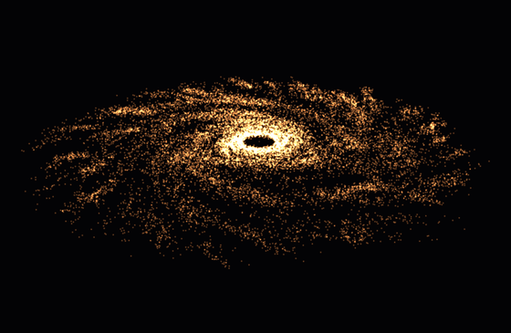

# Ethan Puyaubreau

**I measure what code really costs on the hardware, then make it cheaper.**

HPC and infrastructure engineer. M.Eng.-equivalent from Polytech Paris-Saclay (September 2026) after three years of work-study at EDF R&D and a research stay at Oak Ridge National Laboratory.

**Available January 2027** for HPC, scientific software or infra roles, Paris or Bay Area. For US roles I need visa sponsorship (J-1 or H-1B, which is cap-exempt at national labs and universities).

[Portfolio](https://ethan-puyaubreau.github.io) · [LinkedIn](https://www.linkedin.com/in/ethan-puyaubreau/) · [Google Scholar](https://scholar.google.com/citations?user=VH9ZyxYAAAAJ) · [ORCID](https://orcid.org/0009-0003-1770-8830) · [ethan.puyaubreau@gmail.com](mailto:ethan.puyaubreau@gmail.com)

---

## Oak Ridge National Laboratory, summer 2025

Graduate Research Fellow (GRO program). I built two GPU energy-measurement tools for **Kokkos**, the US Department of Energy's performance-portability framework: a multi-vendor one for NVIDIA and AMD GPUs (NVML, ROCm-SMI) and a finer NVIDIA one that samples every ~10 ms.

- **Ran on Frontier**, the first exascale supercomputer, and on production SLURM clusters.
- **Found a cost wall-clock profiling misses.** Two ArborX algorithms with the same run time drew 925 J and 784 J: 15% apart in energy.
- **Went through public review.** [9 PRs to kokkos-tools and LAMMPS](https://github.com/pulls?q=author%3Aethan-puyaubreau+is%3Apr), 3 merged, including the sampling daemon ([kokkos-tools #300](https://github.com/kokkos/kokkos-tools/pull/300)).
- **Presented.** Poster at the 2025 Smoky Mountains Conference ([*Understanding GPU energy dynamics in HPC applications*](https://github.com/ethan-puyaubreau/smc2025-gpu-energy-poster)), invited to SC25. Cited in ORNL's [S4PST 2024-2025 report](https://www.osti.gov/biblio/3016977).

The analysis side is open source: [energy-dashboard-for-kokkos](https://github.com/ethan-puyaubreau/energy-dashboard-for-kokkos) loads Kokkos energy output into PostgreSQL and Grafana.

## EDF R&D, work-study (2023-2026)

On the C++ platform that simulates EDF's nuclear reactor cores (500k+ lines, 30+ engineers):

- **Wrote the memory and compute-time profilers** (C++, Python bindings). The memory one found a blow-up the team had chased for days.
- **Rebuilt the neutronics solvers as a modular prototype** and measured it with those tools: bit-for-bit identical results, **up to 12% faster** on the compute core, **40% lower peak memory**.
- **Automated the test and delivery chain**: cluster runs, result validation, PostgreSQL ingestion, Debian packaging (Jenkins, GitLab CI/CD).

## Infrastructure I run

A [5-node Proxmox cluster](https://ethan-puyaubreau.github.io/cluster) I have designed and operated alone since 2020: K3s, Ceph, Traefik, Authelia SSO, VyOS-segmented network, self-hosted Git with CI/CD, Prometheus and Grafana. About twenty services for ~60 regular users, and every incident is mine.

**[proxmox-ops-mcp](https://github.com/ethan-puyaubreau/proxmox-ops-mcp)** lets an AI assistant operate that cluster. Every command goes through a deny-by-default classifier; destructive ones wait for my approval on a separate channel and land in an append-only audit log, so a prompt injection cannot approve itself.

## Side project

**[nbody-webgpu](https://github.com/ethan-puyaubreau/nbody-webgpu)**: up to 65,536 bodies in a WGSL compute shader, tiled through workgroup shared memory, leapfrog integrator. [Run it in your browser](https://ethan-puyaubreau.github.io/nbody-webgpu/).

## Stack

**HPC:** C++17/20 · CUDA · Kokkos · MPI · OpenMP · SLURM · NVML · ROCm-SMI\
**Infra:** Proxmox · K3s · Ceph · Docker · Traefik · Ansible · GitLab CI\
**Also:** Python · PyBind11 · PostgreSQL · TypeScript · WebGPU

---

**Hiring for HPC or infra from January 2027? [Email me](mailto:ethan.puyaubreau@gmail.com).**
